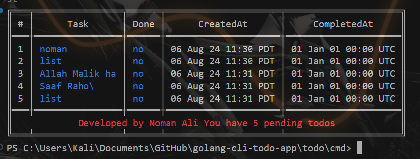
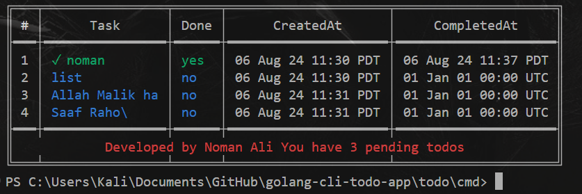

# Todo Application

This is a minimal Todo application written in Go. The application reads tasks from a `.todos.json` file and lists them.

## Prerequisites

- Go 1.16 or later

## Options to perform in this application

- go run main.go -add add {task to add in string}
- go run main.go -list 
- go run main.go -complete {index of task} 
- go run main.go -del {index of task}

## Authors

- [@nomankhokhar](https://www.github.com/nomankhokhar)

## Badges

## 🚀 About Me

I'm a full Stack Developer...